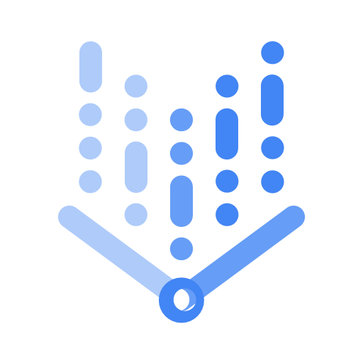

## Google Cloud Platform

:link:-Product page

:page_facing_up:-Documentation

<table>
 <tr>
  <td>
    
  </td>
 </tr>  
 
 <tr>
  <td>
    <h3> AI/ML </h3>
     
    <h4> Create and use ML Model </h4>
  </td>
  
  <td>
    
     
    <a href="https://console.cloud.google.com/vertex-ai">Vertex Dashboard</a> 
     
    <a href="https://cloud.google.com/functions/">:link:</a>
    <a href="https://cloud.google.com/functions/docs/">:page_facing_up:</a>
  </td>
  
  <td>
    
     
    <a href="https://console.cloud.google.com/vertex-ai/workbench/list/instances">Workbench</a> 
     
    <a href="https://cloud.google.com/functions/">:link:</a>
    <a href="https://cloud.google.com/functions/docs/">:page_facing_up:</a>
  </td>
  
  <td>
    
     
    <a href="https://console.cloud.google.com/vertex-ai/pipelines">Vertex Pipelines</a> 
     
    <a href="https://cloud.google.com/functions/">:link:</a>
    <a href="https://cloud.google.com/functions/docs/">:page_facing_up:</a>
  </td>
  
 </tr>
  
 <tr>
  <td>
    <h3> Storage </h3>
  </td>
 </tr>
 
 <tr>
  <td>
    <h3> Database </h3>
  </td>
 </tr>
 
  <tr>
  <td>
    <h3> Data Analytics </h3>
  </td>
 </tr>
 
  <tr>
  <td>
    <h3> Serverless </h3>
  </td>
 </tr>
 
  <tr>
  <td>
    <h3> Management Tools </h3>
  </td>
 </tr>
 
  <tr>
  <td>
    <h3> Application Integration </h3>
  </td>
 </tr>
 
 <tr>
  <td>
    <h3> DevOps CI/CD </h3>
  </td>
 </tr>

 <tr>
  <td>
    <h3> Developer Tools </h3>
  </td>
 </tr>
 
 <tr>
  <td>
    <h3> Compute Scalable VMs and Container </h3>
  </td>
 </tr>
  
 
 
 
 
</table>
